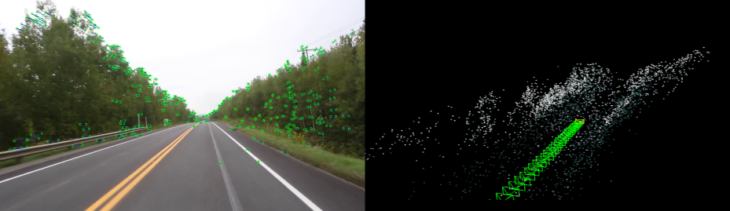

*toy SLAM for fun
___

What we have:
 - feature detection/tracking using **ORB** and **good features to track**
 - Fundamental/Essential matricies estimation using **RANSAC**
 - camera pose estimation and points triangulation
 - visualization with **pangolin viwer**
 - graph (constraints?) optimization with **g2o** optimizer
---
Dependencies:
- `numpy`
- `cv2`
- `pangolin`
- `g2o`
---
Usage:
```bash
d3d=1 d2d=1 python slam.py kitty.mp4
```
where `d3d` is `3D map viewer` and `d2d` is `video viewer`
